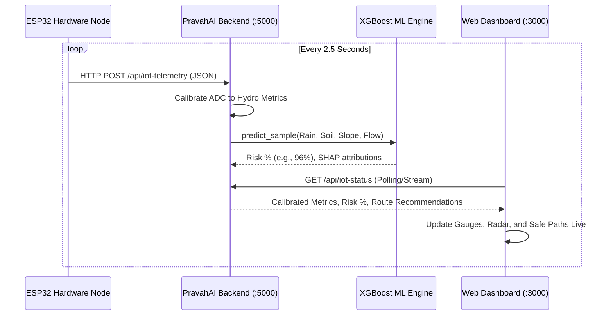

# PravahAI — ESP32 Cyber-Physical Flood Early Warning System
## Hardware Integration & Physics Scaling Architecture Plan

---

## 📌 1. Project Overview & Vision

**PravahAI** is an AI-powered Flash Flood Early Warning and Evacuation Routing System. This document outlines the end-to-end integration of a physical **ESP32 IoT Catchment Node** equipped with multi-sensor telemetry to simulate and demonstrate real-time flash flood triggers during live demonstrations and hackathon judging.

### 🌟 Key Highlights for Demonstration:
1. **Dual-Mode System**:
   - **Mode 1 (Satellite / IMD Live Forecast)**: Real-time global meteorological & hydrological satellite telemetry.
   - **Mode 2 (Physical ESP32 IoT Node)**: Live cyber-physical simulation responding to physical water spray and soil hydration.
2. **Real-time Machine Learning Inference**:
   - Ingests scaled physical sensor data into the **XGBoost Classifier** (`FlashFloodMLModel`).
   - Produces instantaneous **TreeSHAP feature attributions** and confidence scores.
3. **Automated Agentic Action**:
   - Triggers Common Alerting Protocol (**CAP XML**) alerts.
   - Computes **Dijkstra-based safe evacuation corridors** avoiding submerged transit routes.

---

## 🔌 2. Hardware Setup & Pin Mapping

| Sensor Name | Measurement | Sensor Output | ESP32 GPIO Pin | Description |
|---|---|---|---|---|
| **Raindrop / Precipitation Sensor** | Surface Water Accumulation | Analog (AO) | `GPIO 34` (ADC1) | Measures physical water spray intensity. |
| **Water Level Sensor** | River Catchment Depth | Analog (Signal) | `GPIO 35` (ADC1) | Measures water column height in a container. |
| **Soil Moisture Sensor (Capacitive/Resistive)** | Soil Saturation Index | Analog (AO) | `GPIO 32` (ADC1) | Measures volumetric moisture in a soil pot. |
| **DHT11 / DHT22 Sensor** | Ambient Atmosphere | Digital Signal | `GPIO 4` | Measures ambient temperature & relative humidity. |
| **Power Distribution** | VCC / GND | Power Rails | `3.3V / 5V` & `GND` | Common breadboard power bus. |

---

## 📐 3. Mathematical Physics & Calibration Curves

Because small-scale laboratory demonstrations cannot physically deliver 200–350 mm of precipitation, a **Physics Scaling Engine** maps miniature sensor values into catchment-scale parameters.

### A. Precipitation Scaling ($R_{3d}$ & $R_{1h}$)
* **Raw ADC**: Dry ($\approx 4095$) to Saturated Wet ($\approx 400$).
* **Normalized Wetness Index**:
  $$\text{Wetness} = \max\left(0.0, \min\left(1.0, \frac{4095 - \text{RawADC}}{3600}\right)\right)$$
* **Scaled 3-Day Cumulative Rainfall**:
  $$R_{3d} = \text{Wetness} \times 320.0\text{ mm} \times \text{Multiplier}$$
* **Live Hourly Intensity**:
  $$R_{1h} = \text{Wetness} \times 35.0\text{ mm/h}$$

### B. River Depth & Discharge Scaling
* **Submerged Ratio**:
  $$\text{SubmergedPct} = \max\left(0.0, \min\left(1.0, \frac{\text{RawWater} - 300}{3200}\right)\right)$$
* **River Gauge Height ($H$)**:
  $$H = \text{DangerLevel} + (\text{SubmergedPct} - 0.40) \times 1.60\text{ m}$$
* **Volumetric River Discharge ($Q$)**:
  $$Q = 220 + (\text{SubmergedPct} \times 1400)\text{ m}^3/\text{s}$$

### C. Soil Moisture Saturation
* **Soil Wetness Ratio**:
  $$\text{SoilWetness} = \max\left(0.0, \min\left(1.0, \frac{4095 - \text{RawSoil}}{3200}\right)\right)$$
* **Soil Saturation Percentage**:
  $$\text{Soil}_{\%} = \min\left(98.0\%, 35.0\% + (\text{SoilWetness} \times 62.0\%)\right)$$

---

## 🛰️ 4. Data Flow & Communication Protocol



### JSON Telemetry Schema:
```json
{
  "device_id": "PRAVAH-ESP32-NODE-01",
  "state": "Assam",
  "district": "Dhemaji",
  "basin": "A011",
  "raw_rain": 450,
  "raw_water_level": 3400,
  "raw_soil": 380,
  "temperature": 27.5,
  "humidity": 94.0,
  "multiplier": 1.0
}
```

---

## 💻 5. Firmware & Software Files Location

| Component | File Path | Status / Description |
|---|---|---|
| **ESP32 Firmware Sketch** | `src/hardware_node/pravah_esp32_firmware.ino` | Complete Arduino C++ sketch with Wi-Fi & HTTP Client. |
| **Mock Sensor Simulator** | `src/hardware_node/mock_iot_sender.py` | Python test script to simulate dry vs. flood physical packets. |
| **Master Backend API** | `src/backend_api/main.py` | Hosts `/api/iot-telemetry` & `/api/iot-status` endpoints. |
| **Dashboard UI** | `src/frontend_dashboard/index.html` & `app.js` | Dual-mode dashboard supporting Live Web vs Hardware Node. |

---

## 🚀 6. Step-by-Step Live Demonstration Script for Judges

1. **Phase 1: Normal Baseline State (Dry Sensors)**
   - Sensors sit dry on the table.
   - Dashboard displays **Low / Moderate Risk ($\approx 15\% - 30\%$)**.
   - River level indicates **-0.63 m below danger mark** (Green Badge).

2. **Phase 2: Live Flash Flood Trigger (Physical Interaction)**
   - Spray water onto the Raindrop Sensor with a small mist spray bottle.
   - Dip the Water Level Sensor into a glass of water.
   - Insert the Soil Moisture Sensor into moist soil.

3. **Phase 3: Real-Time AI Reaction**
   - In $< 2$ seconds, the Dashboard Gauge swings to **$95\%+$ (Very High Risk / Red Alert)**.
   - River status switches to **$+0.45\text{ m}$ Above Danger Mark**.
   - SHAP explanation highlights: *“Primary Risk Driver: Rapid Antecedent Rainfall ($318\text{ mm}$) and River Channel Overflow”*.
   - Evacuation panel displays high-ground routing along **NH Highland Bypass** and lists verified shelter capacities.
