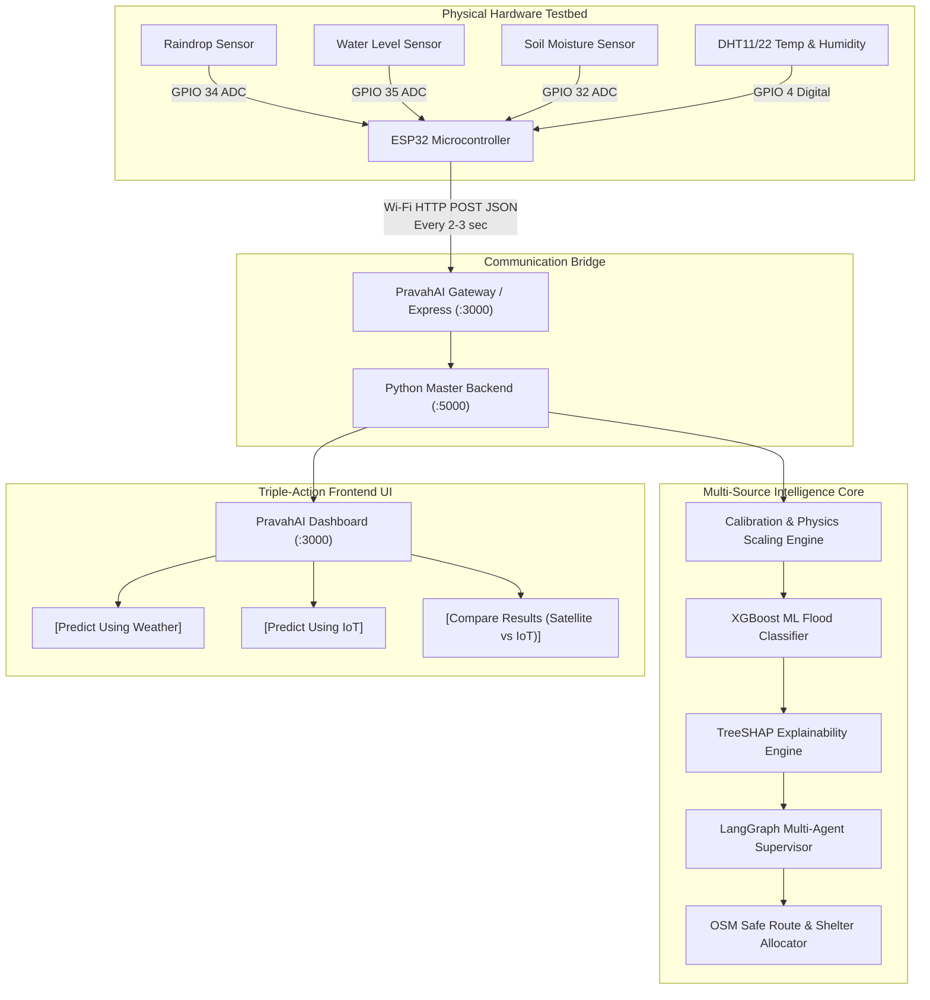
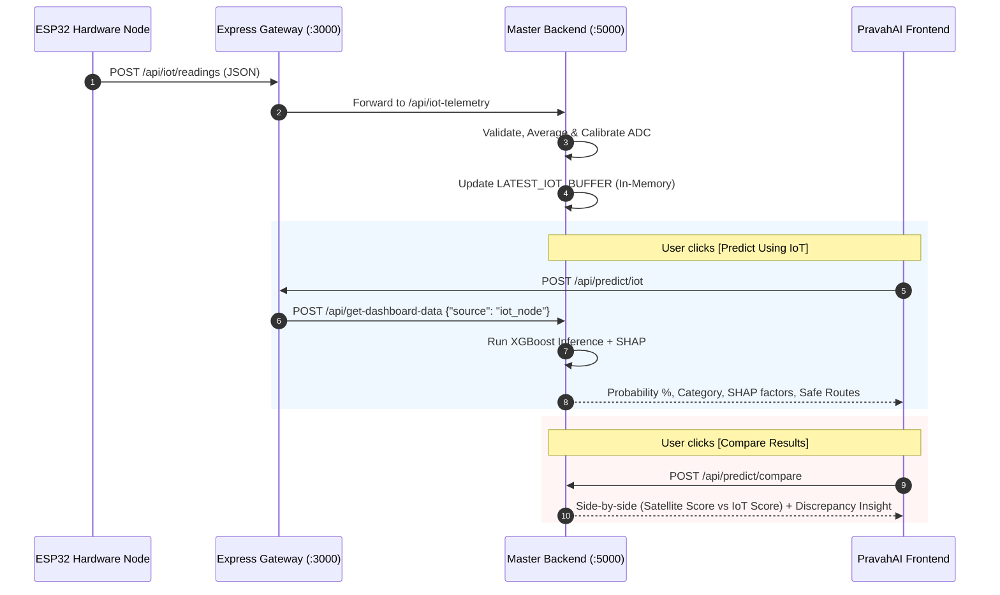

# PravahAI — Unified IoT + ML Flood Risk Intelligence System
## Master Integration Plan: Combining Cyber-Physical Sensing, Satellite Telemetry & Agentic AI

---

## 📌 1. Purpose & System Vision

**PravahAI** integrates two complementary data streams to provide reliable, multi-scale flood forecasting:
1. **Macro/Regional Layer (Satellite & IMD NWP)**: Captures large-scale monsoon anomalies, 3-day satellite precipitation, and catchment-wide topography.
2. **Micro/Local Layer (ESP32 IoT Sensor Node)**: Captures ground-level hydro-physical indicators (soil saturation, immediate precipitation accumulation, river gauge surges).

This document establishes the architecture for a **demo-ready, explainable, source-aware, and technically honest** flood intelligence system.



---

## 🛡️ 2. Technical Honesty & Jury Defense Strategy

> [!IMPORTANT]
> **Hackathon & Evaluation Defense Rule**:
> Low-cost demo sensors (e.g., analog raindrop probes) cannot measure calibrated continuous rainfall volume in exact millimetres. 
> 
> In PravahAI, we explicitly label these measurements as:
> **`Ground IoT Observation (Simulated Rainfall Equivalent Index)`** instead of claiming raw sensor precision.

### 🎯 Pre-empting Jury Cross-Questions:

* **Jury Question**: *"Aapka 2 cm ka rain sensor 200 mm real rainfall kaise measure kar raha hai?"*
  * **Strong Answer**: *"Sir, physical sensor ground-level wetness aur electrical resistance measure karta hai. Humara Calibration Engine use normalized index ($0-100$) me convert karta hai aur trained catchment hydrology curve ke hisaab se catchment-equivalent precipitation estimate karta hai. UI par hum ise clearly 'Simulated Equivalent Index' label karte hain."*

* **Jury Question**: *"Agar Satellite Weather aur Local Sensor me difference ho toh model kya karega?"*
  * **Strong Answer**: *"Humne 'Compare Results' feature diya hai jo discrepancy highlight karta hai — agar Satellite dry dikhata hai lekin Ground Sensor sudden flash surge detect karta hai, toh Agentic AI local warning issue karta hai."*

---

## 🔌 3. Hardware Bill of Materials & Pin Configuration

| Component / Sensor | Sensor Output | ESP32 Pin | Voltage | Role in Demonstration |
|---|---|---|---|---|
| **ESP32 NodeMCU (WROOM-32)** | Wi-Fi 802.11 b/g/n | Microcontroller | 5V / 3.3V | Reads all analog/digital sensors and posts JSON over Wi-Fi. |
| **Raindrop Sensor Module** | Analog Out (AO) | `GPIO 34` (ADC1) | 3.3V / 5V | Detects water spray / drops to simulate precipitation surge. |
| **Water Level Sensor Probe** | Analog Signal (S) | `GPIO 35` (ADC1) | 3.3V / 5V | Measures water depth when immersed in a glass/container. |
| **Soil Moisture Sensor (Capacitive/Resistive)** | Analog Out (AO) | `GPIO 32` (ADC1) | 3.3V / 5V | Measures volumetric moisture difference in a wet soil pot. |
| **DHT11 / DHT22 Sensor** | Digital Serial | `GPIO 4` | 3.3V / 5V | Captures ambient air temperature and relative humidity. |
| **Breadboard + Jumpers** | — | — | — | Clean, solder-less sensor connectivity. |

---

## 📐 4. Mathematical Physics & Calibration Curves

The Python backend converts raw ADC values ($0-4095$) into standardized hydro-meteorological features:

### A. Rainfall Scaling ($R_{3d}$ & $R_{1h}$)
* **Raw ADC**: Dry ($\approx 4095$) $\to$ Saturated Wet ($\approx 400$).
* **Normalized Wetness Index**:
  $$\text{Wetness} = \max\left(0.0, \min\left(1.0, \frac{4095 - \text{RawADC}}{3600}\right)\right)$$
* **Scaled 3-Day Cumulative Rainfall**:
  $$R_{3d} = \text{Wetness} \times 320.0\text{ mm} \times \text{Multiplier}$$
* **Instantaneous Rain Intensity**:
  $$R_{1h} = \text{Wetness} \times 35.0\text{ mm/h}$$

### B. River Catchment Depth & Discharge
* **Submerged Ratio**:
  $$\text{SubmergedPct} = \max\left(0.0, \min\left(1.0, \frac{\text{RawWater} - 300}{3200}\right)\right)$$
* **River Gauge Level ($H$) Relative to CWC Danger Benchmark ($D$)**:
  $$H = D + (\text{SubmergedPct} - 0.40) \times 1.60\text{ m}$$
* **Catchment Discharge ($Q$)**:
  $$Q = 220 + (\text{SubmergedPct} \times 1400)\text{ m}^3/\text{s}$$

### C. Soil Saturation Index ($\%$)
* **Soil Wetness Ratio**:
  $$\text{SoilWetness} = \max\left(0.0, \min\left(1.0, \frac{4095 - \text{RawSoil}}{3200}\right)\right)$$
* **Soil Saturation ($\%$)**:
  $$\text{Soil}_{\%} = \min\left(98.0\%, 35.0\% + (\text{SoilWetness} \times 62.0\%)\right)$$

---

## 📡 5. Backend API Specification & Data Flow



### JSON Telemetry Payload (ESP32 $\to$ Backend):
```json
{
  "device_id": "ESP32_DEMO_01",
  "location": "Demo Lab",
  "state": "Assam",
  "district": "Dhemaji",
  "basin": "A011",
  "raw_rain": 450,
  "raw_water_level": 3400,
  "raw_soil": 380,
  "temperature": 28.5,
  "humidity": 92.0,
  "demo_mode": true
}
```

---

## 🖥️ 6. Frontend Layout & Triple-Action Workflow

### UI Placement:
The IoT monitoring panel is placed directly beneath the **Location & Weather Forecast Section** on the workflow page.

```
+----------------------------------------------------------------------------------------------------+
|  📍 LOCATION: Assam · Dhemaji · A011 Subansiri Basin                                               |
+----------------------------------------------------------------------------------------------------+
|  [ 🌐 SECTION 1: Regional Satellite & IMD Live Forecast (Precipitation: 0.0mm, Soil: 45%) ]       |
+----------------------------------------------------------------------------------------------------+
|  [ ⚡ SECTION 2: Live Ground ESP32 IoT Observation Node ]                                          |
|  Status: 🟢 Connected (Ping: 1.1s ago) | Device: ESP32_DEMO_01                                      |
|  [Rain Index: 88%]  [Water Level: 20.15m (+Danger)]  [Soil: 92%]  [Temp: 28.5°C]  [RH: 92%]        |
+----------------------------------------------------------------------------------------------------+
|  PREDICTION ACTIONS:                                                                               |
|  [ 🌐 Predict Using Weather ]   [ ⚡ Predict Using IoT ]   [ ⚖️ Compare Results (Weather vs IoT) ]  |
+----------------------------------------------------------------------------------------------------+
```

### Triple Action Behavior:
1. **`[Predict Using Weather]`**: Computes risk exclusively using regional Open-Meteo & IMD AWS datasets.
2. **`[Predict Using IoT]`**: Runs XGBoost on scaled physical sensor telemetry (water spray / submerged sensor).
3. **`[Compare Results]`**: Renders side-by-side risk cards:
   - **Satellite Risk**: e.g., $38\%$ (Moderate Risk)
   - **IoT Ground Risk**: e.g., $96\%$ (Very High Flood Risk)
   - **AI Insight**: *"Discrepancy detected. Regional forecast is moderate, but local IoT sensor reports rapid channel surge (+0.32m above danger level). Flash Flood Warning dispatched."*

---

## 🔒 7. Admin Security, Role-Based Access & Audit Logging

| Security Feature | Implementation Mechanism |
|---|---|
| **Authentication** | JWT-based token authentication (`/api/admin/login`). |
| **Role-Based Access** | Roles: `Admin` (Broadcast alerts), `Operator` (Calibrate sensor offsets), `Viewer` (Read-only monitoring). |
| **API Protection** | Middleware validation on all `/api/admin/*` and `/api/iot/calibrate` routes. |
| **Audit Logging** | Every CAP XML broadcast is saved with Timestamp, Severity, Operator ID, and Delivery Status. |

---

## 🧪 8. End-to-End Test Scenarios

| Test Case | Physical Sensor Action | Expected Scaled Metric | Expected ML Prediction |
|---|---|---|---|
| **Scenario 1: Dry Baseline** | Dry sensor, dry soil pot, water sensor in air | Rain: $0\text{ mm}$, Soil: $40\%$, River: Below Danger | **Low Risk ($15\% - 30\%$)** — Green Badge |
| **Scenario 2: Water Spray Only** | Mist spray applied to Raindrop Sensor | Rain: $280\text{ mm}$, Soil: $45\%$, River: Normal | **Moderate/High Risk ($60\% - 75\%$)** |
| **Scenario 3: Flash Flood (Full Demo)** | Water spray + Submerge sensor in glass + Wet soil | Rain: $318\text{ mm}$, Soil: $92\%$, River: $+0.45\text{ m}$ Above Danger | **Very High Risk ($95\% - 99\%$)** — Red Alert + Evacuation |
| **Scenario 4: Node Offline** | Power off ESP32 / Disconnect Wi-Fi | Heartbeat $> 12\text{s}$ | UI shows **⚪ Awaiting Hardware Node** (No false live claims) |

---

## 🚀 9. Phased Development Roadmap

```
[Phase 1: Firmware & Pinout Test] ➔ Verify Serial Monitor readings on ESP32
       │
[Phase 2: Ingestion & Scaling API] ➔ Implement /api/iot-telemetry & physics scaling in main.py
       │
[Phase 3: Triple-Action UI Bar] ➔ Add [Weather], [IoT], and [Compare] buttons on Dashboard
       │
[Phase 4: Side-by-Side Comparison Engine] ➔ Implement Dual-Gauge + Discrepancy Insight
       │
[Phase 5: Live Demonstration Rehearsal] ➔ Spray water test & jury presentation dry run
```
